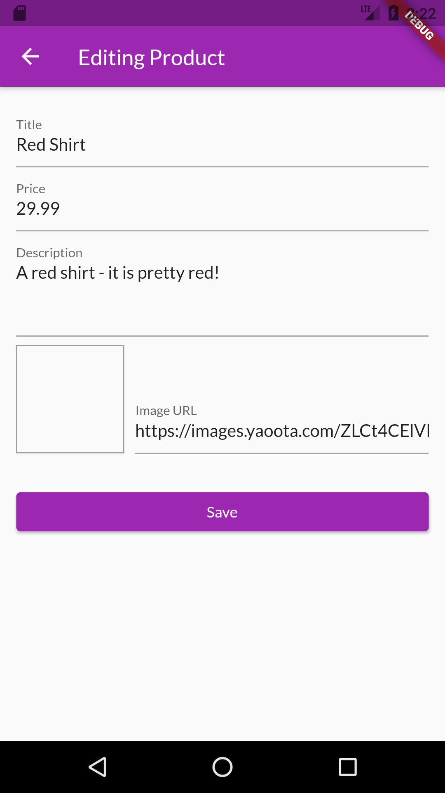
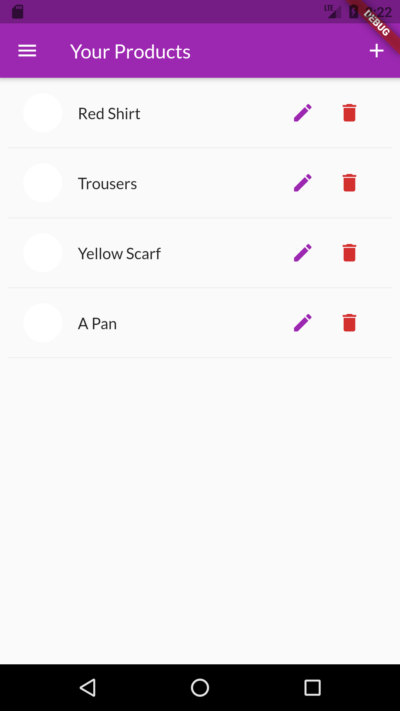
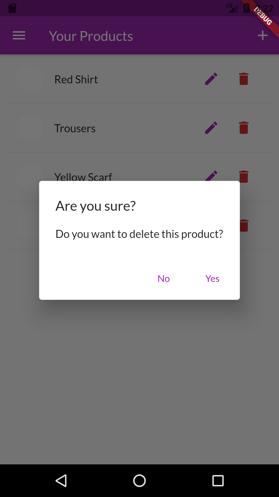
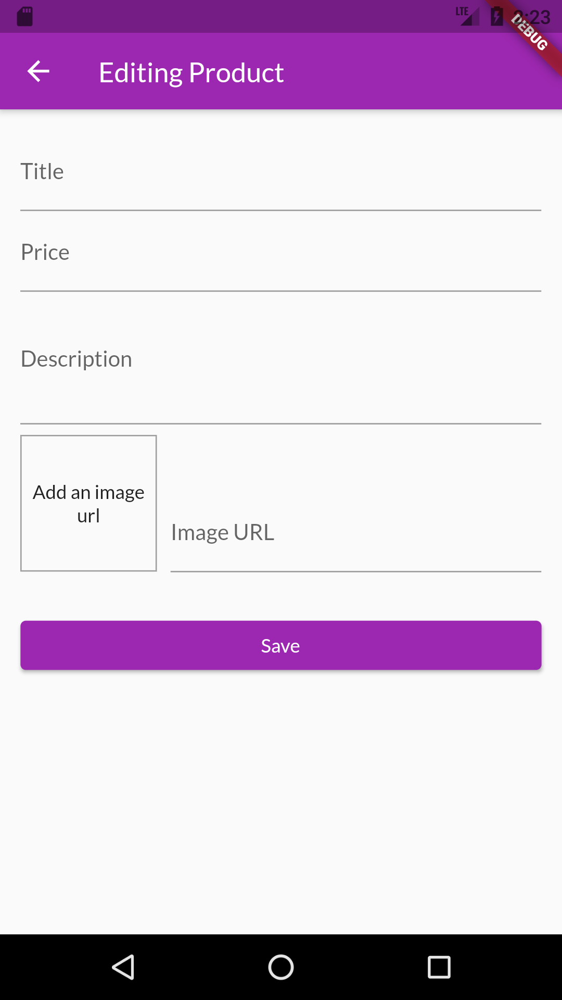

# Product Manager App 

-Implemented with Flutter and Dart

-Providers

-Google Firesbase

Disclaimer : The idea of the project and the orginal code is not mine. I just coded along with a course taught by Maximilian Schwarzmüller on udemy, 
which you can find a link to it down below : 

https://www.udemy.com/course/learn-flutter-dart-to-build-ios-android-apps/ 

Here are some screenshots of the app : 

                                  
